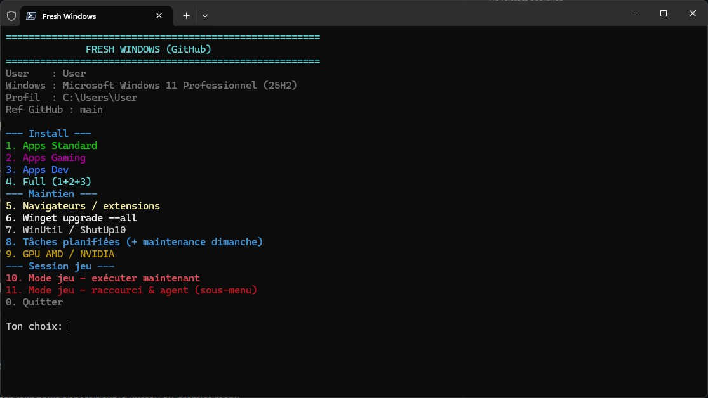

# Fresh Windows

Toolbox PowerShell pour réinstaller et entretenir Windows après un formatage. Les listes d’applications, tweaks et réglages sont versionnés en JSON sur GitHub : tu modifies, tu pousses, tu relances.

PowerShell **administrateur** — lance avec Bypass (évite le blocage ExecutionPolicy au premier run) :

```powershell
powershell -NoProfile -ExecutionPolicy Bypass -Command "irm https://raw.githubusercontent.com/nico2511/fresh_windows/main/launcher.ps1 | iex"
```

Déjà dans une console admin :

```powershell
Set-ExecutionPolicy -Scope Process Bypass -Force
irm https://raw.githubusercontent.com/nico2511/fresh_windows/main/launcher.ps1 | iex
```

Au premier lancement réussi, le launcher pose `RemoteSigned` pour **CurrentUser** et crée un raccourci **Fresh Windows** sur le Bureau (déjà en Bypass).



---

## Démarrage rapide

| Étape | Menu | Action |
|------:|:----:|--------|
| 1 | **5** | Full setup — apps standard + gaming + dev |
| 2 | **8** | Tweaks one-click (WinUtil + AppX + perfs) |
| 3 | **9** | Tâches planifiées (winget, maintenance, sync) |
| 4 | **11** | Mode jeu (lancer / raccourci / agent) |
| 5 | **6** | Extensions navigateurs + profil Brave (si besoin) |

---

## Menu

| # | Section | Description |
|---|---------|-------------|
| 1 | Apps standard | Navigateur, utilitaires, sécurité, bureautique |
| 2 | Apps gaming | Launchers, overlays, outils GPU |
| 3 | Apps dev | Éditeurs, runtimes, CLI |
| 4 | Apps custom | Paquets utilisateur détectés automatiquement |
| 5 | Full setup | Enchaîne 1 + 2 + 3 |
| 6 | Navigateurs | Extensions Firefox/Chrome + policies Brave |
| 7 | Winget upgrade | Met à jour toutes les apps winget |
| 8 | Tweaks | One-click, ShutUp10, presets WinUtil |
| 9 | Tâches | MAJ quotidienne + maintenance hebdo + sync scripts |
| 10 | GPU / Chipset | AMD Adrenalin / Ryzen Master, NVIDIA / NVCleanstall, chipset Intel DSA / AMD |
| 11 | Mode jeu | Kill list, raccourci Bureau, agent systray |
| 0 | Quitter | — |

---

## Paquets d’applications

Trois paquets intégrés vivent dans `configs/` :

- `apps-standard.json`
- `apps-gaming.json`
- `apps-dev.json`

### Paquets custom

Le 4ᵉ type de paquet est **auto-détecté**. Dépose un fichier `*.json` (même format que les paquets intégrés) dans l’un de ces emplacements :

| Emplacement | Portée |
|-------------|--------|
| `configs/apps-custom/` | Repo / fork (partagé via GitHub) |
| `%LOCALAPPDATA%\FreshWindows\apps-custom\` | Machine locale uniquement |

Le menu **4** liste les paquets trouvés. Un paquet local du même nom remplace la version distante.

**Trouver un ID winget** : [winstall.app](https://winstall.app) ou `winget search NomDeLApp`.

Exemple minimal :

```json
[
  "7zip.7zip",
  "Microsoft.PowerToys"
]
```

Apps hors catalogue winget (exe / zip) :

```json
{
  "name": "MonApp",
  "url": "https://example.com/MonApp.exe",
  "destDir": "%LOCALAPPDATA%\\Programs\\MonApp",
  "fileName": "MonApp.exe",
  "shortcut": true
}
```

---

## Mode silencieux

```powershell
powershell -NoProfile -ExecutionPolicy Bypass -Command "$env:FRESH_WIN_MODE='full'; irm https://raw.githubusercontent.com/nico2511/fresh_windows/main/launcher.ps1 | iex"
```

Modes utiles : `standard` | `gaming` | `dev` | `custom` | `custom:mon-paquet` | `full` | …

`exit 0` = succès, `exit 1` = au moins une étape en échec.

| Mode | Rôle |
|------|------|
| `standard` / `gaming` / `dev` / `full` | Installs winget (+ téléchargements URL) |
| `custom` | Tous les paquets custom détectés |
| `custom:nom` | Un paquet custom précis |
| `winutil-oneclick` / `maintenance` | Tweaks WinUtil (+ ShutUp10 en maintenance) |
| `winutil-standard` / `minimal` / `advanced` | Presets WinUtil |
| `winutil-appx` | Debloat AppX |
| `brave-optimize` / `betterzen` | Policies Brave / Betterfox Zen |
| `tasks` | Enregistre les tâches planifiées |
| `game-mode` / `game-mode-shortcuts` / `game-mode-watch` | Mode jeu |
| `winget-upgrade` | `winget upgrade --all` |
| `powertoys-profile` / `shutup10` | Profils dédiés |

### Figer une version

```powershell
$env:FRESH_WIN_REF = 'abc1234'   # commit, tag ou branche
powershell -NoProfile -ExecutionPolicy Bypass -Command "irm `"https://raw.githubusercontent.com/nico2511/fresh_windows/$env:FRESH_WIN_REF/launcher.ps1`" | iex"
```

---

## Architecture

| Chemin | Rôle |
|--------|------|
| `launcher.ps1` | Point d’entrée (`irm \| iex`), menu, installs |
| `scripts/lib/` | Modules (Core, WinUtil, Tasks, GPU) |
| `scripts/GameMode-*.ps1` | Mode jeu + agent systray |
| `configs/*.json` | Listes apps, tweaks, extensions, GPU |
| `configs/apps-custom/` | Paquets utilisateur (auto-listés) |
| `guides/` | Guides NVIDIA / AMD / ShutUp10 / chipset |

Ordre de chargement des libs : `Import-CachedScript` → `Core` → `WinUtil` → `Tasks` → `GpuMenus`.

Lancement distant : cache sous `%LOCALAPPDATA%\FreshWindows` (epoch `FreshWindowsLibEpoch` pour invalider quand `FRESH_WIN_REF` reste `main`).

---

## Mode jeu

Ferme les processus hors session jeu (dev, IA locale, sync, tray sécurité, messagerie hors Discord/Legcord…). **Ne tue jamais** la famille de launcher d’une session active. Sans session claire → aucun launcher tué. Active **Ultimate Performance** au lancement.

Config : `configs/game-mode-kill.json` (domaines, protections, familles de launchers) et `configs/game-mode-watch.json` (seuils agent).

Scripts locaux : `%LOCALAPPDATA%\FreshWindows\` + marqueur `scripts.ref`. Agent au logon via la tâche `FreshWindows-WatchAgent`.

### Fresh Agent (systray)

Core **sans IA obligatoire** : skills, session jeu, monitoring. Couche IA optionnelle (Ollama, tool calling sur le registry skills), STT **Windows Speech**, TTS Windows/Piper, RAG guides.

- Doc : [guides/fresh-agent.md](guides/fresh-agent.md)
- Sync complet : `scripts/Sync-FreshWindowsAgent.ps1` ou menu systray / tâche `FreshWindows-SyncLocalScripts`
- Overrides user : `agent-ai.user.json`, `skills-apps.user.json`, `inventory.json` (non écrasés)

---

## Tâches planifiées

| Tâche | Quand | Action |
|-------|-------|--------|
| `FreshWindows-WingetUpgrade` | Quotidien 12:00 | `winget upgrade --all` |
| `FreshWindows-WinUtilReapply` | Dimanche 12:00 | Mode `maintenance` |
| `FreshWindows-SyncLocalScripts` | Dimanche 12:30 | Resync agent (mode jeu + Fresh Agent + skills) |

La ref `FRESH_WIN_REF` est figée dans la tâche à l’enregistrement. Logs : `%LOCALAPPDATA%\FreshWindows\logs\`.

---

## Navigateurs & tweaks

**Brave** — à l’install, policies sous `HKLM\SOFTWARE\Policies\BraveSoftware\Brave` (coupe Rewards/Wallet/VPN/Leo/News ; garde Shields, Sync, Tor). Vérif : `brave://policy`.

**Zen** — Betterfox `user.js` écrit à l’install.

**Everything** — service et démarrage auto désactivés après install.

**ShutUp10** — winget `OO-Software.ShutUp10` + profil CLI `configs/shutup10-recommended.cfg`. Voir [guides/shutup10.md](guides/shutup10.md).

**GPU / Chipset** — menu 10 + [guides/nvidia-nvcleanstall.md](guides/nvidia-nvcleanstall.md) / [guides/amd-adrenalin.md](guides/amd-adrenalin.md) / [guides/chipset.md](guides/chipset.md). Chipset : Intel DSA (winget) ou AMD Chipset Software (URL selon socket). DDU et NVCleanstall sont dans les listes apps ; le nettoyage GPU propre se fait en mode sans échec (voir guide NVIDIA).

---

## Projets tiers

Fresh Windows orchestre des outils externes ; ils restent la propriété de leurs auteurs. Liens et usage dans ce repo :

| Projet | Lien | Rôle ici |
|--------|------|----------|
| **Chris Titus Tech WinUtil** | [GitHub](https://github.com/ChrisTitusTech/winutil) · [lancer](https://christitus.com/win) | Tweaks / presets / AppX (`irm christitus.com/win`) |
| **Betterfox** (yokoffing) | [GitHub](https://github.com/yokoffing/Betterfox) | `zen/user.js` appliqué à Zen Browser (mode BetterZen) |
| **O&O ShutUp10++** | [site](https://www.oo-software.com/en/shutup10) | Confidentialité Windows + profil CLI `shutup10-recommended.cfg` |
| **NVCleanstall** (TechPowerUp) | [téléchargement](https://www.techpowerup.com/download/techpowerup-nvcleanstall/) | Install drivers NVIDIA ciblée |
| **Display Driver Uninstaller** (Wagnardsoft) | [site](https://www.wagnardsoft.com/) | Nettoyage pilotes GPU (mode sans échec) |
| **Bulk Crap Uninstaller** | [GitHub](https://github.com/BCUninstaller/Bulk-Crap-Uninstaller) | Désinstallation / nettoyage apps |
| **UniGetUI** | [GitHub](https://github.com/marticliment/UniGetUI) | UI winget / mises à jour |
| **PowerToys** (Microsoft) | [GitHub](https://github.com/microsoft/PowerToys) | Utilitaires + profil `powertoys-profile.json` |
| **winget** + **winstall.app** | [winget](https://github.com/microsoft/winget-cli) · [winstall](https://winstall.app) | Catalogue d’IDs et installs |
| **Intel Driver & Support Assistant** | [Detect](https://www.intel.com/content/www/us/en/support/detect.html) | Chipset / pilotes Intel |
| **AMD** (Adrenalin, Chipset, Ryzen Master) | [drivers](https://www.amd.com/en/support/download/drivers.html) | GPU + chipset + utilitaire CPU |
| **NVIDIA** | [drivers](https://www.nvidia.com/Download/index.aspx) | Pilotes GeForce / Studio |

Respecte les licences et conditions de chaque projet. Fresh Windows ne redistribue pas leurs binaires : téléchargement à l’exécution (winget, `irm`, URL constructeur).

---

## Tests

```powershell
powershell -NoProfile -File .\tests\Validate-Configs.ps1
powershell -NoProfile -File .\tests\Run-AllTests.ps1
```

---

## Prérequis

- Windows 10 / 11
- PowerShell administrateur
- winget + réseau
- Premier lancement : one-liner avec `-ExecutionPolicy Bypass` (voir ci-dessus) ; GPO machine trop stricte peut encore bloquer
- Pas de mode hors-ligne pour le lancement `irm`

Les listes par défaut reflètent une stack personnelle : fork et adapte les JSON avant une install massive.

## Licence

Usage perso. Fork et adaptation libres pour ta machine.
